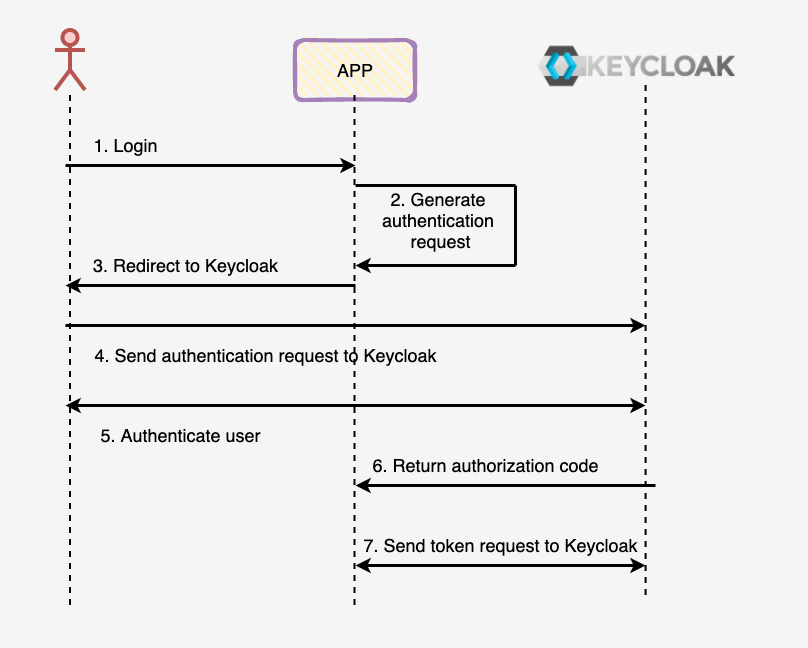

# Keycloak - Gestion de l'Authentification et de l'Autorisation
# 📖 theorie :
## 1. Qu'est-ce que Keycloak ❓❓
Keycloak est une solution IAM (Identity and Access Management) qui permet de gérer l'authentification et l'autorisation de manière centralisée pour toutes les applications.


Keycloak prend en charge principalement trois services essentiels (AAA) :

- 🪪🔐 **Authentification**  : Vérifie l'identité des utilisateurs en utilisant différentes méthodes telles que l'authentification classique avec mot de passe, le Single Sign-On (SSO) ou l'authentification multifactorielle (MFA).
- 👮🏻 **Autorisation** : Gère les droits d'accès des utilisateurs aux différentes ressources ou applications en fonction des rôles et des permissions associés à chaque utilisateur.
- **Accounting** : Enregistre les actions des utilisateurs dans l'application et gère les sessions pour voir les utilisateurs connectés en temps réel ainsi que les logs d'événements (tentatives de connexion, échecs d'authentification, etc.).

Keycloak prend également en charge les fonctionnalités suivantes :
- **Single Sign-On (SSO)** : Permet aux utilisateurs de se connecter une seule fois et d'accéder à plusieurs applications sans devoir se reconnecter.
- **Authentification multifactorielle (MFA)** : Ajoute une couche de sécurité supplémentaire en exigeant plusieurs facteurs d'authentification.

---

## 2. Protocoles supportés par Keycloak
Keycloak prend en charge plusieurs protocoles standard pour l'authentification et l'autorisation, notamment :
- **OAuth 2.0** : Protocole d'autorisation permettant aux applications d'accéder aux ressources protégées sans exposer les informations d'identification des utilisateurs.
- **OpenID Connect (OIDC)** : Extension d'OAuth 2.0 permettant l'authentification des utilisateurs et la récupération de leurs informations de profil.
- **SAML (Security Assertion Markup Language)** : Protocole utilisé pour le SSO entre applications et fournisseurs d'identité.
- **LDAP** : 

---

## 3. Les différents types de tokens
Keycloak utilise plusieurs types de tokens pour gérer l'authentification et l'autorisation :
- **Access Token** : Utilisé pour accéder aux ressources protégées. Il contient les informations sur les permissions accordées à l'utilisateur.
- **ID Token** : Fournit des informations sur l'utilisateur authentifié (nom, email, rôles, etc.).
- **Refresh Token** : Permet d'obtenir un nouveau token d'accès sans que l'utilisateur ait besoin de se reconnecter.

Ces tokens sont généralement au format JWT (JSON Web Token) et sont signés pour garantir leur intégrité et leur sécurité.

---
## 4. Flux d'authentification

---

## 5. conceptes generales 

- Realm
- Client 
- Users
- Roles
- Clims
- Client Scoop
- Mappers

# 🔨 Pratique : Installation et Configuration de Keycloak

## 1. ⏬ Installation de Keycloak 

Vous avez deux options pour installer Keycloak :
- Télécharger, installer et configurer Keycloak manuellement.
- Utiliser une image Docker de Keycloak pour une installation simplifiée, il suffit de run la commande: 
```bash
docker compose -f 'docker-compose.yaml' up -d --build
```
### Installation avec Docker
 📍 Dans cet exemple, nous utiliserons une image Docker de Keycloak (voir `docker-compose.yml`) ;  Avec l'image Docker, aucune configuration manuelle n'est requise. Il suffit de lancer l'image et de gérer votre conteneur.

---

## 2. ⚙️ Configuration de Base de Keycloak

### 🔹 Qu'est-ce qu'un Realm ?
Un **Realm** est une instance de gestion des utilisateurs, rôles et clients dans Keycloak. Chaque Realm est isolé des autres.

### 🔹 Création et Configuration d'un Realm
Accédez à l'onglet **'Realm Settings'** pour configurer :
- **Général**
- **Login**
- **Email**
- **Thèmes**
- **Sessions**
- **Profil utilisateur & Inscription des utilisateurs**

### 🔹 Ajout d'un Client
Un **Client** représente une application sécurisée par Keycloak.
- Rendez-vous dans **Clients** et ajoutez votre application.
- Configurez les **capabilities**, une étape cruciale pour comprendre les options disponibles.

### 🔹 Gestion des Utilisateurs
- Ajout des utilisateurs via l'interface Keycloak.
- Définition d'un mot de passe par défaut via **Credentials**.

---

## 3. Gestion des Rôles et des Permissions

### 🔹 Différence entre les rôles Realm et les rôles Client
- **Rôles Realm** : Applicables à plusieurs clients.
- **Rôles Client** : Spécifiques à un client donné.

### 🔹 Ajout et Attribution de Rôles
- Créez des rôles dans l'onglet **Roles**.
- Assignez ces rôles aux utilisateurs pour gérer leurs permissions.

---

## 4. Configuration de l'Authentification et des Politiques

### 🔹 Authentification & Politiques de Sécurité
- Ajoutez des règles de sécurité comme la longueur minimale des mots de passe, etc.

### 🔹 Ajout de Providers
Ajoutez des **providers** pour enrichir les fonctionnalités d'authentification de Keycloak.

---

## 5. Tester Keycloak avec Postman
Avant d'intégrer Keycloak avec Spring Boot, testez les endpoints via **Postman**.

## 6. Endpoints de Keycloak que tu peux tester avec Postman

### 🔹 Obtenir un token d'accès
```
POST http://localhost:8080/realms/{realm-name}/protocol/openid-connect/token
Content-Type: application/x-www-form-urlencoded

body:
- grant_type=password
- client_id={client-id}
- client_secret={client-secret}
- username={username}
- password={password}
```

### 🔹 Récupérer les informations de l'utilisateur connecté
```
GET http://localhost:8080/realms/{realm-name}/protocol/openid-connect/userinfo
Authorization: Bearer {access-token}
```

### 🔹 Récupérer les rôles d'un utilisateur
```
GET http://localhost:8080/admin/realms/{realm-name}/users/{user-id}/role-mappings
Authorization: Bearer {admin-access-token}
```

### 🔹 Créer un utilisateur
```
POST http://localhost:8080/admin/realms/{realm-name}/users
Authorization: Bearer {admin-access-token}
Content-Type: application/json

body:
{
  "username": "newuser",
  "enabled": true,
  "credentials": [{ "type": "password", "value": "password" }]
}
```

---
### 📌 Conclusion
Keycloak est une solution robuste et flexible pour la gestion des identités et des accès. Grâce à ses fonctionnalités avancées telles que le SSO, la gestion des rôles et permissions, ainsi que le support des protocoles standards, il est un excellent choix pour les entreprises cherchant à sécuriser leurs applications de manière centralisée.

---
## 🚀🚀🚀  To do   : 


## 📌 Ressources Complémentaires
🎥 **Tutoriel recommandé** : [Tuto Keycloak](https://youtu.be/toEVcosbedw?si=5SDDEFJYILUofbgU)

