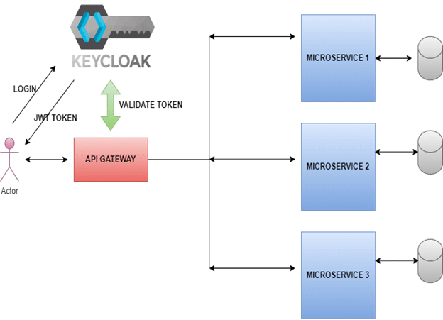

# Installation et Configuration de Keycloak

## 1. Installation de Keycloak

Vous avez deux options pour installer Keycloak :
- Télécharger, installer et configurer Keycloak manuellement.
- Utiliser une image Docker de Keycloak pour une installation simplifiée, il suffit de run la commande: **docker-compose up -d**

### Installation avec Docker
Dans cet exemple, nous utiliserons une image Docker de Keycloak (voir `docker-compose.yml`).

✅ Avec l'image Docker, aucune configuration manuelle n'est requise. Il suffit de lancer l'image et de gérer votre conteneur.

## 2. Configuration de Base de Keycloak

### 🔹 Qu'est-ce qu'un Realm ?
Un **Realm** est une instance de gestion des utilisateurs, rôles et clients dans Keycloak. Chaque Realm est isolé des autres.

### 🔹 Création et Configuration d'un Realm
Accédez à l'onglet **'Realm Settings'** pour configurer :
- **Général**
- **Login**
- **Email**
- **Thèmes**
- **Sessions**
- **Profil utilisateur & Inscription des utilisateurs**

### 🔹 Ajout d'un Client
Un **Client** représente une application sécurisée par Keycloak.
- Rendez-vous dans **Clients** et ajoutez votre application.
- Configurez les **capabilities**, une étape cruciale pour comprendre les options disponibles.

### 🔹 Gestion des Utilisateurs
- Ajout des utilisateurs via l'interface Keycloak.
- Définition d'un mot de passe par défaut via **Credentials**.

---

## 3. Gestion des Rôles et des Permissions

### 🔹 Différence entre les rôles Realm et les rôles Client
- **Rôles Realm** : Applicables à plusieurs clients.
- **Rôles Client** : Spécifiques à un client donné.

### 🔹 Ajout et Attribution de Rôles
- Créez des rôles dans l'onglet **Roles**.
- Assignez ces rôles aux utilisateurs pour gérer leurs permissions.

---

## 4. Configuration de l'Authentification et des Politiques

### 🔹 Authentification & Politiques de Sécurité
- Ajoutez des règles de sécurité comme la longueur minimale des mots de passe, etc.

### 🔹 Ajout de Providers
Ajoutez des **providers** pour enrichir les fonctionnalités d'authentification de Keycloak.

---

## 5. Tester Keycloak avec Postman
Avant d'intégrer Keycloak avec Spring Boot, testez les endpoints via **Postman**.

## 6. Endpoints de Keycloak que tu peux tester avec Postman

### 🔹 Obtenir un token d'accès
```
POST http://localhost:8080/realms/{realm-name}/protocol/openid-connect/token
Content-Type: application/x-www-form-urlencoded

body:
- grant_type=password
- client_id={client-id}
- client_secret={client-secret}
- username={username}
- password={password}
```

### 🔹 Récupérer les informations de l'utilisateur connecté
```
GET http://localhost:8080/realms/{realm-name}/protocol/openid-connect/userinfo
Authorization: Bearer {access-token}
```

### 🔹 Récupérer les rôles d'un utilisateur
```
GET http://localhost:8080/admin/realms/{realm-name}/users/{user-id}/role-mappings
Authorization: Bearer {admin-access-token}
```

### 🔹 Créer un utilisateur
```
POST http://localhost:8080/admin/realms/{realm-name}/users
Authorization: Bearer {admin-access-token}
Content-Type: application/json

body:
{
  "username": "newuser",
  "enabled": true,
  "credentials": [{ "type": "password", "value": "password" }]
}
```

---

## 📌 Ressources Complémentaires
🎥 **Tutoriel recommandé** : [Regarder sur YouTube](https://youtu.be/toEVcosbedw?si=5SDDEFJYILUofbgU)

---

🚀 **Vous êtes maintenant prêt à intégrer Keycloak dans votre projet !**

## Bute  : 

